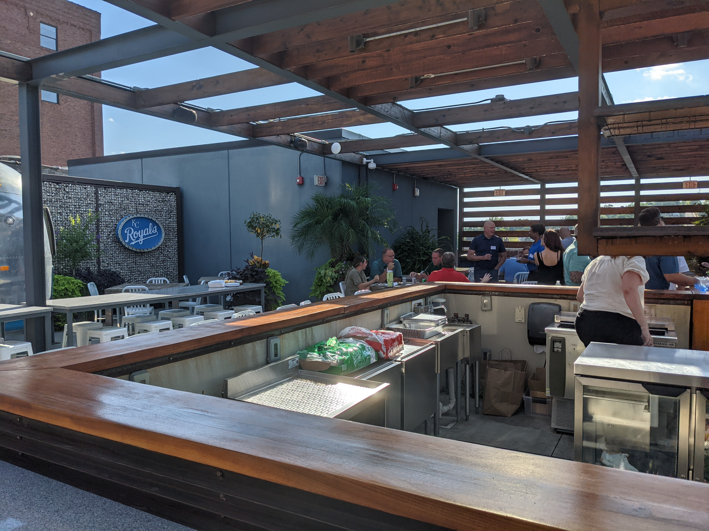
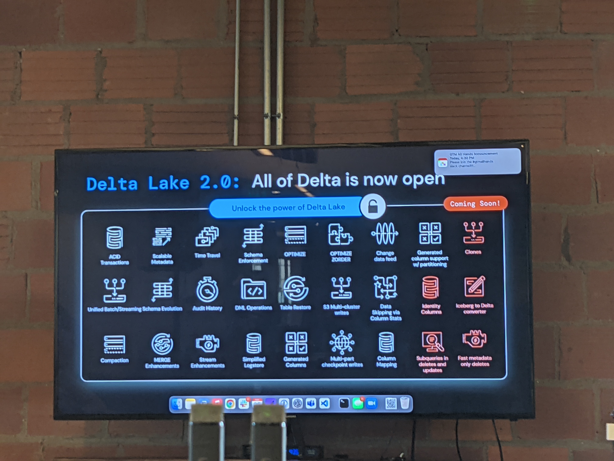
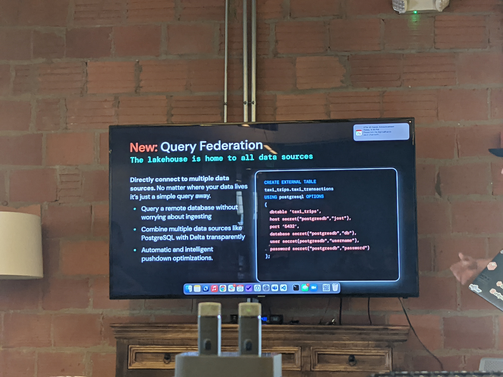

# Overview

I attended a [Databricks Community Kick-off Event](https://go.valorem.com/DatabricksKickOff.html) on Aug 25, 2022.  This event is hosted by a local software company called Valorem Reply group.
Valorem's office is Kansas City downtown by the Union Station.  They also have a nice deck area can see Kauffman Center and World War One Museum. 

Valorem Reply office

[Spencer Cook](https://www.linkedin.com/in/spencercookdata) gave us a talk on the latest Databricks development.  Those includes Delta Lake 2.0, Spark Connect, Delta Sharing and Cleanrooms, Databricks SQL Serverless, Unity Catalog, Databricks Marketplace, MLflow 2.0.  Some of those new features are recent release after our Q1 2022 PoC trial.   Spencer mentioned several companies Disney, Regeneron, T-Mobile, HSBC, Sam's club, Toyota...etc.  They definitely span many industries.

Delta Lake has several open source projects and repositories such as Delta connectors, Delta Rust, Delta sharing, Kafka-delta-ingest.
Delta sharing maximizing the value of data sharing, ML models.

Lots of partnerships big cloud providers, and tools such as labelbox, IDE such as Pycharm.

##  Delta Lake 2.0

Delta Lake 2.0 comes with many new features.  A lot of performance improvement and reliabilities.
Enzyme ETL optimizer automatic reduce cost of ETL performance increase.  It felt like Delta table is more like database with query optimizer and faster performance from ACID.  It also added Change Data Capture (CDC) can build incremental pipelines.  Other features multi clusters write to S3, retore (rollback) to previous table versions.  They also have **more integration with Flink can read streaming data in continuous mode.**

### Python UDF can integrate ML into sql.  He said the whole model training script could be run inside a SQL.  This can be setup automatic retraining from a trigger. 

### Query federation can directly connect multiple data sources. 

### Data model with constraints like database tables. 

### Materialized view speed up queries with precomputed queries.

## Unity Catalog
Single place for all data governance and AI assets.  Federated identify model can config user and group access.  Catalog is the concept to organize collections of tables and views for access.
A lineage view allows user to see how table is derived from another table. A audit log provides detail tracking how data is accessed and by whom.

## Delta sharing and Cleanrooms
[Delta sharing](https://www.databricks.com/blog/2022/06/28/introducing-data-cleanrooms-for-the-lakehouse.html) allows secure data sharing with no replication. We could form data-sharing partnerships with external stakeholders. Business cases to collaborate across the value chain.

## Photon
[Photon](https://www.databricks.com/product/photon) is a rewrite of Spark in C++, much improved performance.

## Spark Connect
[A decoupled client-server architecture for Spark](https://www.databricks.com/blog/2022/07/07/introducing-spark-connect-the-power-of-apache-spark-everywhere.html).
Improve Stability, upgradability, Debuggability and Observability.  Now one spark driver cannot cause the whole cluster to go down.

## Databricks SQL Serverless
This is only on AWS. Checking the serverless box resulted in a 3x reduction in our infrastructure costs.

## MLflow 2.0
[MLflow 2.0](https://www.databricks.com/blog/2022/06/29/introducing-mlflow-pipelines-with-mlflow-2-0.html) MLflow Pipelines provides a standardized framework for creating production-grade ML pipelines. Same great MLflow tracking, now at the workflow level.
**This will help data scientist write production ready ML pipeline code** instead of turn it over to ML engineer to rewrite the code.  It is like Apache Maven POM to ship Java code for ML pipeline.

# Summary

I also met with several data engineer, developer, data scientist in the KC area.  It was good to learn their experience using Databricks or other alternatives.  I also met a former principal engineer from Valorem that went to Databricks, and a data scientist from HR Block who are using Databricks. The principal engineer mentioned Databricks founder are all very technical original coder of Apache Spark, Apache Mesos...etc.  
