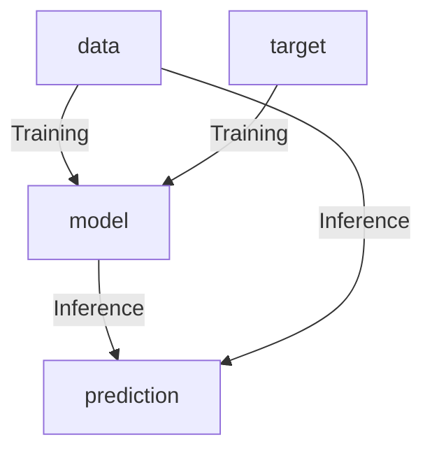

# Overview

Between Aug 8, 2022 - Aug 10, 2022 I attended [KCDC 2022 conference](https://www.kcdc.info/).  
This conference is one of the largest developer conferences in Kansas City area.
Over 1700 people attended this year, 190 presenters, and 55 sponsors.
I have been attending this conference before the pandemic since 2016.  But this is the first time I went back there in person, and I am glad I went.
There are several Data Science talks focused on MLOps, ML Strategy, Culture, Machine Learning, Data engineering.  I particular enjoyed MLOps and Culture talks I attended.  
I want to write a Hugo blog to summarize what I learned.

## MLOps

### Want to Build Super Models?  Invest in MLOps by Raj Nair VP at Concentrix Catalyst 

[Raj Nair](https://www.linkedin.com/in/rajnair-bigdata) is a VP at Concentrix Catalyst.  His company Yotabites Consulting was acquired by Concentrix three years ago.  Since acquisition he has been leading Concentrix's Data Science CoE org.  His talk is emphasizing on MLOps to realize Machine Learning values.
He first talked about prevalent assumptions or misconception in Data Science space.  Those are more related to culture:
* Engineering leader thought Data Scientists already know about enterprise level IT.
* IT organizations understand data science.
* Build enterprise data science platforms is a one-time transaction.
* Consumers of data products know how to get what they want.
* Build models is mostly what data science is about (how you get models assets to get consumers).

Then he clarified on why investing in MLOps is the missing piece in many organizations. On culture aspect inside many organizations the engineering team and the data science team does not understand each other. ML platform's evolution and continuous improvement is a must.  
The consumers of the data product do not understand what they want, they rely on data scientist to tell them and translate their business problem into a data science problem.
MLOps helps provision infrastructure, save models, manage dependencies, orchestrate model calling, and serve model in a scalable fashion to accelerate the time to value of AI/ML applications.

Raj said Enterprise ML is largely an engineering challenge, then Raj showed the diagram from the [full-cycle data science paper] (https://proceedings.neurips.cc/paper/2015/file/86df7dcfd896fcaf2674f757a2463eba-Paper.pdf) where ML code is a small box in the middle of bigger boxes around it.
There are many important components besides ML code in a modern ML platform. Here are some of the challenges:
1. ML models are data hungry.
2. ML models need Constant retraining.
3. Feature used need to be actively maintained.
4. Debugging ML models is complex.
5. Small change in real world data decays model.

The industry ML development process CRISP-DM and ASUM-DM (modified version from IBM) are not complete.  However, a model developed is not a model deployed, data scientist may not have the skills to figure out how to get models to consumer for below reasons:
1. Scalability (service many consumers meeting performance SLAs)  red-flag redesign needs to maintain performance
2. Modularity (pre-processing pipelines and serving interfaces are cleanly designed and manageable)
3. Extensibility (New requirements or needs are easy to incorporate)
4. Variance Testing (model versions may have variations, baseline compare model performance)

ML models have a training and production phases.
Software development is **deterministic** meaning software works in testing environment then it will work the same way in production.  While ML model is a different beast.
Below points are where ML differs from Software:
1. Consistent performance at scale.
2. Handle data drift (independent variables changes).
3. Handle concept drift (dependent variable changes).
4. Flexible to support multiple consumption requirement.
5. Lineage tracking on model features.
6. Tracking both model performance metrics and **operational metrics**. We certainly need to do a better job on monitoring KPI become better advocate what values are generated from models in production.

Model monitoring requires both operational and functional requirement.  
It is difficult to make connection between drift monitoring from inference pipeline to training pipeline. (What metrics or KPI we use to know when to retrain a model?)

Two types of models serving pipelines are "Train by Batch, predict real time" or "Train by batch predict in batch."

Then Raj talked about how data scientists are organized, they are mostly imbedded in product or market organizations. **They are not surrounded by those other roles that support them.**
Beside Data Scientist role there are many other roles and Responsibilities to make the ML model works:
* **ML Architect role** (the new role is responsible for designing and fitting together different ML components)
* ML engineer
* Data engineering architect
* Data engineering

Here are ML tools and Technologies in three categories:
* Cloud Native such as AWS Sagemaker, MS Azure ML, Google Vertex AI.
* Open source such as MLFLow, Kubeflow, Metaflow, MLReef, Evidently AI.
* Vendors such as Domino Data Lab, Databricks, Dataiku, Datarobot.

In summary:
* Model developed is not a model deployed.
* MLOps is needed for success of data science efforts.
* Start small but do not start late.
* Educate the organization.

I asked a question how to select which technologies or tools in ML platform.  Raj said it would require understanding organization's current set of tools and find pieces to fit into them.

### Portable Machine Learning Deployments in the Cloud by Salman Iqbal ml ops engineer @appvia

Salman Iqbal actually flied from UK to KC to give this talk.  He currently worked at Appvia which provide cloud Kubernetes clusters.  

Kubeflow is open-sourced Kubernetes based ML platform. It is cloud native and would work on OCI, GCP, AWS, Azure...etc.  Therefore, it would be very easy to migrate to any ML platform and Kubernetes is very scalable.

Salman showed OpenAI project GPT-3 which can train itself to [write postgre SQL queries] (https://blog.seekwell.io/gpt3) given some instructions, 
Or [convert movie titles into emoji] (https://beta.openai.com/examples/default-movie-to-emoji), Or painting from free text [DALL-E](https://openai.com/blog/dall-e/)
or connecting image and text [CLIP] (https://openai.com/blog/clip/)

Use docker Container to build it support python, text, tensor-flow. Kubernetes manages containers.  
The advantages are:
* Kubernetes cluster load balance on multiple pods
* Smart scheduling low priority vs high priority, GPU vs CPU
* Pod Auto scaler (save resources)

Salman explained the Machine learning process are ETL -> training -> analysis -> prediction.
Kubeflow manages ML in Kubernetes. All in python code. 
Kubeflow uses Jupyter, Pipelines, Operators (MXNet, Pytorch jobs), Katib (AutoML), Metadata, KFServing.  A lot of open-source community support.

Kubeflow Pipeline is a Multi-step ML workflow, Python SDK, easy to Productionize.

Training process involves Kubeflow notebook.  He mentioned each notebook instances are running as a separate Kubernetes Pod.
[Kubeflow Pipelines SDK] (https://pypi.org/project/kfp/) can schedule run containerized tasks using Python code and/or YAML. 

Serving process involves backend api MxNet operator.

Lastly why say no to Kubernetes:
* Cloud services. I asked him to clarify he said use an existing cloud services such as AWS Sagemaker can be both a pro and con in this case
* Complexity
* Auto scaling
* cost

I connected with him after his talk.  He also mentioned Kubeflow has its own DevOps challenges for ML. 

## ML
		
### Build and Deploy Production Ready Pytorch Models by Henk Boelman Senior Cloud Advocate @ Microsoft

[Henk Boelman] (https://www.henkboelman.com/) Senior Cloud Advocate at Microsoft.  This session is a nice demo of Transfer Learning, reuse a pretrained model on a new problem.
The demo is a computer vision classification model.  Take a existing deep learning CNN pretrained model then train it on additional dataset 
which in this case is several pictures of Homer or Marge from "the Simpsons".  

Model is trained and deployed using Azure Machine Learning ml.azure.com.  Azure is Microsoft's cloud ML platform.  It supports both "All code", "No-Code", or "Some code" (Machine Learning pipeline using the Azure ML designer) options.
Henk then talked about ML life cycle from data pre, model building, model training, model registration, and model deployment.  
There is also a Flow diagram for inferencing target.  For imaging recognization models it is labeling service.  The final step is a Test-endpoint.

[Henk's GitHub repo](https://github.com/hnky/pytorch-workshop) has the step by step workshop for this talk for anyone wants to try Azure Machine Learning.  
Setup environment, train pytorch model, deploy model, automate training pipeline and register models.
1. GitHub action training pipeline
2. Model management using event management
3. Deployment

				
### Actually using your trained model by Evan Hennis@Microsoft

This is an interesting talk on TensorFlow Lite by Evan Hennis from Microsoft.  I heard Google wants to push TensorFlow Lite to run on all IOT/Android devices.
Tensor Flow JS is primary works on browser and Google wants to developer to transition to use TensorFlow Lite.
Evan demoed a simple TensorFlow model basically convert Fahrenheit to Celsius temperature.  Then use TensorFlow.js to convert to JavaScript and use Google Cloud to deploy as an endpoint and call endpoint.
Then he demoed use Microsoft Azure Machine Learning studio to register the model, deploy real time endpoint and call it. 

In conclusion we can use a pretrained model then convert model to validate TF.js or TS Lite format and deploy to the Cloud, Azure or GCP.

			
### Predicting Earthquake damage with Azure ML workspace by Eve Pardi

Eve Pardi is a Microsoft Azure Machine Learning consultant.  She demoed how easy it is to use Azure ML service to train and deploy an earthquake prediction model.
The demo is straight forward, and I am not a fan of use some of the auto-ml features though. 
* Azure Machine Learning Studio demo - compute, inference, labeling service, data
* Registered models are ready to deploy as endpoint
* Auto-ML has "enable deep learning" options (scary to use)
* Deploy, download model, explain model, view generated model code, test model, register model, feature importance graph
* Azure ML Designer (no code option)

### A gentle introduction to Deep Learning by Laurent Bunion

This is a begging deep learning talk.  But I am a fan of this talk because it explains the deep learning theories understandable to non-data scientist.

First, he explained the evolution from Intelligence to artificial intelligence to deep learning.  

He used a nice diagram to show how machine learning is different to regular software algorithm.  Regular software algorithm uses rule and data to return result, 
while machine learning takes data and result/labels to return set of rules/algorithm then we can use rules/algorithm to return prediction in production.
Why machine learning is getting more popular now because big data, computing power such as GPU...etc.

Then he explained deep learning theories such as Sum of Product/Dot product, Activation function sigmoid function, relu.
Apply a deep learning model to image recognization by considering each image pixels as a RGB vectors.  Set weights by reasoning, then use try and error minimize loss by steepest loss gradient descent.
Avoid local minimal by using random/stochastic gradient descent many times.
He demoed a DNN model of pizza vs hotdog classification in Azure.  Solve model over-fitting using regularization, early stopping or drop percentage of neurons.

There are several ethics issue in ML. For example, in health care area a model predict pneumonia with a feature patient condition of asthma less likely to get pneumonia is wrong.
Race bias example: Google photo predict Black friends as gorillas.

Other resources:
* [FATE: Fairness, Accountability, Transparency, and Ethics in AI] (https://www.microsoft.com/en-us/research/theme/fate/)
* [Ethics in AI video] (https://www.youtube.com/watch?v=x9gan8vOBJ8)

## Culture

### Create a culture of recognization by Ash Banaszek

Ash Banaszek is UX advocate at Union Pacific Railroad. I want to learn to be better at recognization. 
I am thrilled to learn a few things in this culture talk. Ash started the talk by some literature review including Harvard Business Review articles on why recognization is important.
* When people experience recognization from their manager they are more productive.
* Team performs tasks better when their members believe their colleagues respect and appreciate them.
Noted recognization is not teambuilding.  

When should you do it?  Be specific, descriptive, and timely.
It is important to connect the dots on why, what, and be honest.

Positive reinforcement is the highest when as soon as possible after an accomplishment. Or about a "week of" is the best time.
It is tailored to the recipient.  
Knows what motivates the team?  Is it gift? money? time off? face time? public praise? personal note?
Know your people. Efforts matter.

What merits the recognization?  It could be anything of the followings:
* Saving time and efforts.
* Make workday or deliverable better.
* Not regular at work.
* Something cool.
* Reinforce the good behavior.

Recognition is a relationship and reputation building.
* Build recognition into your work.
* Schedule it every Friday in calendar.
* Put in performance goals.
* Include in project milestone.
* Talk about it in leadership.

Recognization is everyone's responsibility.  Not just manager, recognize everyone including Teammates, Other work teams, Roles above you, contractors.  Be specific.
Recognization must be visible and supported by the top. Avoid gate-keeping traps.

Some of the excuses:
* "That is their job anyway".
* "What if people don't think it's fair?" asks other what to make it fair.
* "My folks don't need to be coddled"?
* "We already have yearly bonuses".
* "They are not on my team someone else can do it".
* "It's not worth my time".
* Under-recognizing for fear of "watering down" recognition.

Genuine gratitude is key. How should you do it:
* Tailor your recognization.
* Recognition is a thank you gift.
* Vary your approach for effect.
* Make it a habit.
* Build a reputation for gratitude (build a culture of it).
* Encourage others to do the same (recognize the recognizers).

Pitfalls to avoid:
* Inauthentic.
* Ignoring standard practices.
* Folks feeling isolated or unseen.
* Overcompensating - ease into it.
* "checking the box".
		
				
### DevOps at Netflix by Tejas Chopra @Netflix

Tejas Chopra is a senior software engineer at Netflix.  The conference room is packed with attendees some sitting on floors.  
As an engineer I have heard Netflix open-source projects such as spinnaker and Chaso Monkey in DevOps space.  Tejas said his talk is non-technical not focused on actual code but thought process and culture at Netflix.
I've read Netflix culture deck before, but I was not sure before going into this talk how much trust Netflix put into its Engineers.

He first said Netflix has massive scale: 221M members, 190+ countries, 1,000s of microservices, 10,000 daily production changes, 10,000 VMs, 100k customer interactions, 1 billion time series metrics, 10 billion hours streamed every quarter, despite the scale only 10 DevOps engineers!
This means **every Netflix dev engineer are also ops engineers**.  He said everybody at Netflix is responsible for the production issues.  Can we ask our people to take such ownership???

Netflix has a loosely coupled architecture.  
Netflix has a list of Don't:
* Have systems that say No to engineers.
* Uptime at all costs (surprising but he explained the cost of have all uptime for all system is not reasonable).
* Processes and procedures (surprising, he said they are still like a large startup).
* Require standards.
* Silos, walls, fences.
* Guesses, intuitions.
* Devops (He said everybody at Netflix is responsible for the production issues).

Netflix has a list of Do:
* Freedom and responsibility (use any language for your service).
* Velocity of innovation.
* Trust (He said engineer can access latest Netflix shows without any access control).
* Enablement.
* Making ownership easy, you build it, you run it (An example is Spinnaker).
* Data.
* Culture.

On actual Devops he works on Netflix drive, they use Jenkins, Spinnaker, Brew/pkg on osx, using yum on centOs, chocolatey on windows, Sentry for logging.
* Lots of A/B testing.
* Trust people for all access.
* Have multiple people cross learning ownership of the services.
* Cloud is good for storage but not great economical for compute when scale is large. They started moving away from AWS to on-premises.
* No ridged team structure, everyone can work on everything. Start to have product manager to put in some process.  Huge startup.

## Strategy
				
### Developing your AI Strategy by Matthew Renze

Matthew Renze is a frequent speaker at KCDC.  I know I have listened to his talk on AI strategies in the past KCDCs.
The purpose of develop successful AI strategy is to automate the operating model, to build an AI factor at the center, to leverage value for competitive advantage.

AI is machine perceives its environment and perform tasks. Machine learning is subset of artificial intelligence (AI) that provides systems the ability to automatically learn and improve from experience without being explicitly programmed. 
Deep learning is subset algorithms within Machine Learning.  Matthew said AI is the frontier of automation.  He then listed several innovation companies in various industries.
For example, AI in fast food service industry such as Robo burger, Steller Pizza, DW scooping ice-cream, Cafex robotic coffee bot, Pudu robot smart delivery cleaning robot.

Matthew also mentioned AI organization.  The AI organization is those companies successful in AI strategy.  To be more specific AI organization Automate the operating model (procurement, HR…etc.), Build AI factory at the center, Leverage the value, increase value for the customer.
Matthew compared Blockbuster vs. Netflix when Netflix was successful at all three strategies.  

AI organization is 
* Digital
* Data driven
* Automatable with AI
* Lean less non-technical workers
* Agile
He noted all above feed into each other and not every organization has done well in all aspects.

Matthew did to case studies of Marriot vs. Airbnb and Wells Fargo vs. Ant group.

Lastly, Matthew listed some of the AI Failures, AI ethics is important part of strategy
* Accessibility
* Bias
* Social network
* Emotional
* Financial

### Build a tech career strategy by Philip Wolfe@Orion

This is a culture talk by Philip Wolfe from Orion.  Orion is fintech company.

Philip first distinguishes between Strategy, goal, dream.
All of us has passion, competencies, and skills.  The sweet spot is intersection between passion needs competencies, skills.

For early career person to know I am the only one who is managing my career.
Career planning needs to have a mission, be realistic and with timelines.  Contribute to the organization, have goals on skills and experiences.  Set some milestones, don't stop at milestones until goal is reached.

Refining strategy.  Understand Luck happens when preparation meets opportunity.
Opportunity because:
* Competencies (behavior, teamwork, reliabilities, communication)
* Skills.
* Industry.
* Trends.
* Player/competitors.
* The most important decisions about my career are made in a room where I am not present. 
* Leader is looking for people who are already doing the job.
* Ability managing the change.
* Let the track record and talent make me the obvious choice.

Executing the strategy:
* Career progression need to move the pieces to execute.
* Find the leader help you achieve what you want to achieve and help them with what they want.
* Conscious competence ladder.  Unconscious incompetence, conscious incompetence, conscious competence, unconscious competence.
* Early career - Develop a wish list, three-year plan, culture, tech growth, type of projects technologies. Inside the company - presentation/ user groups.  Outside the company - meet up/local college
* Mid-career - know what you do not know, develop good people and tech skill, still looking for perfect industry, find and develop your strengths.
* Late mid-career - know a lot about people and technology, looking for a purpose, looking for a place to commit, share passion with others, lead from strength, hire for your weakness.
* Finishing career - your knowledge and actions are automatic, end well and tie up loose ends, communication becomes deliberate, built and maintained many friendships, care about coworkers and company, protect your people, develop hobbies, give back.
* Not matter what stage find a mentor, cohort, and protégé.  You will make mistakes, life is too short to wait on pursuing your goals.

In summary
* Corporate ladder was not designed for you in mind.
* Certification is ok.
* Leader is looking for T shape people not true.  A T-shaped person is capable in many things and expert in, at least, one. As opposed to an expert in one thing (I-shaped) or a “jack of all trades, master of none” generalist, a “t-shaped person” is an expert in at least one thing but also somewhat capable in many other things. 
* If I love what I do I will never work a day in my life.
* I need to build a brand is false.
* Once I reach the goal I will be happy is not true, you need to reevaluate.

## Data Engineering

### Building a Unified metrics layer with OSS tools for Big Data by adnan Rahic @cube.dev

This is a data engineering talk.  I was intrigued to attend because I know we are building a Unified data foundation layer.  Why not a a unified metrics layer for Machine Learning algorithms?
There are multiple tools consuming data from one source, need support for data notebook, BI tools, low-code tools, front-end web apps.  

The Data provider API headaches are:
* Generate and drop SQL?  Security issue from SQL ingestion?
* authentication & authorization
* Cache? 
* Drop PostgreSQL and use column-oriented database.

How to Perform downstream calculation on data?

Inconsistencies between teams?

Performance issue: He performance simple queries took > 9 seconds on 1 billon row dataset on GCP PostgreSQL db.  PostgreSQL is row-oriented database is not good on big data.
Column based db is more suitable for Big data.

The he discussed difference between OLTP vs OLAP.

A Unified metrics layer can support data modeling, access control, caching, API would be nice.
Cube has a headless business intelligence for building data apps, a middleware between data sources and data consumers.
Exposed APIs to support central location for accessing all data.  API can be sued by Superset, Tableau, Streamlit, Deepnote, jupyter.
It supports Role-based access control, Multi-tenancy, No more confusion between the teams
It supports Pre-aggregations and that reduce pulling data source and increase query performance.

I came away from the talk knowing this company called cube.dev has built a unified data retrieval tool that can consistently, efficiently, standardized way to pull data. 